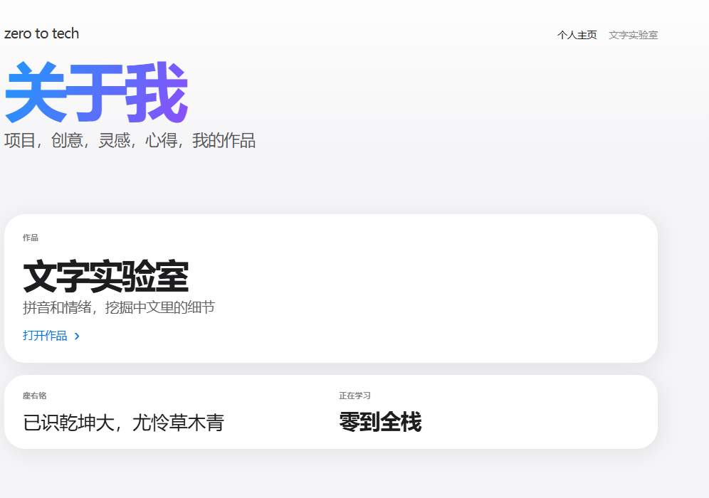
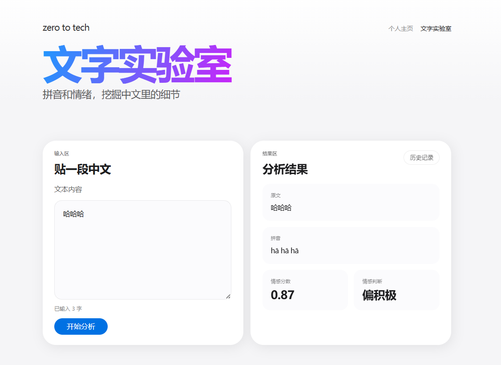
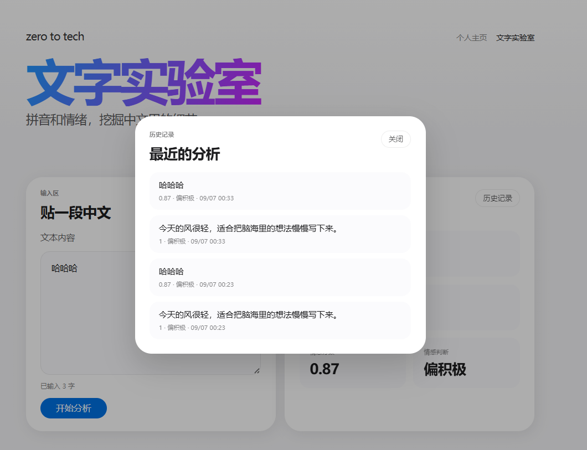

<div align="center">

# Zero to Tech · 零到全栈

**从零开始的全栈练习项目** — 个人主页 + 「文字实验室」，前端 Next.js，后端 FastAPI，随手贴一段中文，立即得到拼音与情感分析。

<!-- 徽章区 -->


*「已识乾坤大，尤怜草木青」*

</div>

---

## 📖 项目简介

这是「零到全栈」系列课程第 4–5 模块的项目作品，用一条完整的「前端 → 后端 → 数据库」链路演示全栈开发：

- **个人主页（`/`）**：展示座右铭、正在学习的内容与代表作；页面数据在后端 `/api/profile`，前端打开时动态拉取。
- **文字实验室（`/text-lab`）**：粘贴一段中文，后端用 SnowNLP 计算情感倾向（分数 + 偏积极/中性/偏消极），用 pypinyin 标注拼音，并把每次分析写入 SQLite，可回溯历史。

项目刻意保持「小而完整」——单页路由、状态提升、前后端分离、CORS、环境变量、SQLite 持久化，是理解真实 Web 应用的理想骨架。

---

## ✨ 功能特性

| 特性 | 说明 |
| --- | --- |
| 🏠 个人主页 | 动态数据驱动（前端 `data/site.js` 打底 + 后端 `/api/profile` 覆盖） |
| 🔤 拼音标注 | 基于 pypinyin，带声调输出（`jīn tiān de fēng hěn qīng`） |
| 😊 情感分析 | 基于 SnowNLP，输出 0–1 情感分数与三档判断 |
| 🗄️ 历史记录 | 每次分析自动入库 SQLite，`/api/history` 返回最近 10 条 |
| 🎬 卡片动画 | anime.js 卡片飞入 + 分数滚动特效 |
| 📱 响应式 | 纯 CSS 实现移动端适配 |

---

## 🛠️ 技术栈

**前端**
- [Next.js 15](https://nextjs.org/)（App Router，`output: "export"` 纯静态导出）
- [React 19](https://react.dev/)
- [anime.js 4](https://animejs.com/) — 卡片入场与分数动画
- 原生 CSS（reset / variables / layout / hero / nav / cards / lab / responsive）

**后端**
- [FastAPI](https://fastapi.tiangolo.com/) + [uvicorn](https://www.uvicorn.org/)
- [pypinyin](https://pypi.org/project/pypinyin/) — 中文转拼音
- [SnowNLP](https://pypi.org/project/snownlp/) — 中文情感分析
- SQLite（`sqlite3` 标准库，无 ORM）

---

## 🚀 快速开始

### 环境要求

| 依赖 | 版本 |
| --- | --- |
| Node.js | ≥ 18（Next.js 15 要求） |
| Python | ≥ 3.10 |

### 1. 启动后端（端口 8000）

```bash
cd backend
pip install -r requirements.txt
uvicorn main:app --reload --port 8000
```

启动后 API 文档可访问 <http://127.0.0.1:8000/docs>。

### 2. 启动前端（端口 3000）

新开一个终端：

```bash
# 回到项目根目录
npm install
npm run dev
```

打开 <http://localhost:3000> 即可。

> 前端通过 `NEXT_PUBLIC_API_BASE_URL`（见 `.env.local`）连接后端，默认 `http://localhost:8000`；启动后端前需在根目录创建该文件：
>
> ```bash
> echo "NEXT_PUBLIC_API_BASE_URL=http://localhost:8000" > .env.local
> ```

### 3. 生产构建（静态导出）

```bash
npm run build
```

产物输出到 `out/`（Next.js 静态导出模式，可直接丢到任意静态托管）。

---

## 📂 项目结构

```
zero-to-tech/
├── app/                       # Next.js App Router（文件夹 = 路由）
│   ├── layout.jsx             # 全站外壳：html/body + CSS 引入
│   ├── page.jsx               # 路由 "/" → 个人主页
│   └── text-lab/
│       └── page.jsx           # 路由 "/text-lab" → 文字实验室
├── components/                # React 组件
│   ├── HomeView.jsx           # 主页视图（"use client"，拉取 /api/profile）
│   ├── TextLabView.jsx        # 实验室视图（状态提升：共享 result）
│   ├── InputCard.jsx          # 输入区：POST /api/analyze
│   ├── ResultCard.jsx         # 结果区：拼音 + 情感分数动画
│   ├── Nav.jsx                # 顶部导航（Link + 当前页高亮）
│   ├── PageHeading.jsx        # 页面标题（服务端组件）
│   └── AnimatedCardGrid.jsx   # 卡片飞入动画容器
├── css/                       # 按职责拆分的原生样式
├── data/
│   └── site.js                # 站点文案集中地（数据与界面分离）
├── backend/                   # FastAPI 后端
│   ├── main.py                # 应用入口 + 三个 API
│   ├── storage.py             # SQLite 存取（init_db / save_record / get_history）
│   ├── handmade.py            # 早期「手写 HTTP 服务」版本（教学留存）
│   ├── requirements.txt
│   └── history.db             # SQLite 数据文件（运行时生成）
├── .env.local                 # NEXT_PUBLIC_API_BASE_URL（本地环境变量）
├── next.config.mjs            # output: "export" 静态导出
└── package.json
```

---

## 🔌 API 一览

### `GET /api/profile`

返回个人主页数据：

```json
{
  "heroTitle": "关于我",
  "heroSubtitle": "项目，创意，灵感，心得，我的作品",
  "featuredWork": { "kicker": "作品", "title": "文字实验室", "copy": "拼音和情绪，挖掘中文里的细节", "linkLabel": "打开作品" },
  "identity": { "motto": "已识乾坤大，尤怜草木青", "learning": "零到全栈" }
}
```

### `POST /api/analyze`

请求体 `{ "text": "要分析的中文" }`，返回：

```json
{
  "text": "今天的风很轻",
  "score": 0.86,
  "label": "偏积极",
  "pinyin": "jīn tiān de fēng hěn qīng",
  "created_at": "2026-09-03T12:00:00+00:00"
}
```

> `score` 为 SnowNLP 情感分数（0–1）；`label` 按阈值划分：`≥ 0.6` 偏积极、`≤ 0.4` 偏消极、其余中性。

### `GET /api/history`

返回最近 10 条分析记录（按时间倒序，来自 SQLite）。

---

## 🧠 设计要点（教学主旨）

- **数据与界面分离**：文案集中在 `data/site.js`，改内容不动组件。
- **文件夹即路由**：App Router 下新增 `app/blog/page.jsx` 即可获得 `/blog`，无需路由配置。
- **服务端 / 客户端组件**：有交互的组件写 `"use client"`，纯展示组件保持服务端渲染。
- **状态提升**：`TextLabView` 持有 `result`，`InputCard` 产出、`ResultCard` 消费，兄弟组件共享状态。
- **容错**：前端请求失败时保留打底数据并输出错误提示，页面不崩溃。

---

## 📚 课程背景

本项目为「零到全栈」AI 时代全栈开发系列课程第 4–5 模块的随堂作品，从模块 4.4 的单页应用一路演进而来（`backend/handmade.py` 保留了早期手写 HTTP 服务的版本，可对照理解框架做了什么）。

---

## 📄 License

MIT — 自由学习、修改与分发。


# 界面截图









---

# 文字实验室

一个中文文本分析小工具：输入一段话，给出情感倾向评分和全文拼音，
并把每次分析的结果存下来，各人只看得到自己的那一份。

零到全栈课程的贯穿项目。

## 技术栈

- 前端：Next.js（静态导出）＋ React
- 后端：FastAPI ＋ uvicorn
- 分析：snownlp（情感）、pypinyin（注音）
- 存储：SQLite
- 线上：Nginx

## 本地跑起来

需要：Node.js 18+、Python 3.10+

**后端**

```bash
cd backend
python3 -m venv .venv
source .venv/bin/activate
pip install -r requirements.txt
cp .env.example .env          # 按下面「配置说明」填好
fastapi dev                   # → http://localhost:8000
```

**前端**（另开一个终端）

```bash
npm install
cp .env.example .env.local    # 按下面「配置说明」填好
npm run dev                   # → http://localhost:3000
```

## 部署到服务器

前提：服务器上已装好 Python 3.10+、Node.js 18+ 和 Nginx，
且 Nginx 的站点根目录已指向本项目的 `out/`、监听 80 端口。

**1. 拉取代码**

```bash
cd ~/zero-to-tech
git pull
```

**2. 前端：装依赖、写配置、构建**

```bash
npm install
cp .env.example .env.production   # 按下面「配置说明」填好
npm run build                     # 产物进 out/，由 Nginx 提供服务
```

**3. 后端：建环境、装依赖、写配置**

```bash
cd backend
python3 -m venv --prompt=zero-to-tech .venv   # 首次部署才需要
source .venv/bin/activate
pip install -r requirements.txt
cp .env.example .env              # 按下面「配置说明」填好
```

**4. 后端：在后台跑起来**

```bash
nohup .venv/bin/fastapi run > backend.log 2>&1 &
```

`fastapi run` 是生产模式，监听 `0.0.0.0:8000`；`nohup ... &` 让它在
SSH 断开后继续运行，日志写进 `backend.log`。

查看日志、停止服务：

```bash
tail -f backend.log           # 看日志
ps aux | grep fastapi         # 找到进程号
kill 进程号                    # 停掉
```

**5. 放行 8000 端口**

去云平台控制台的安全组 / 防火墙，放行 8000 端口（80 端口应该已经放行）。

**6. 验证**

浏览器访问 `http://服务器IP`，打开文字实验室做一次分析，再看历史记录。
换一个浏览器（或无痕窗口）再试一次，两边的历史记录应该是互相看不到的。

## 配置说明

配置文件不进 Git，请照着 `.env.example` 自己建一份。

**前端**：开发用 `.env.local`，生产构建用 `.env.production`

| 键 | 说明 | 本地 | 线上 |
| --- | --- | --- | --- |
| `NEXT_PUBLIC_API_BASE_URL` | 后端接口地址 | `http://localhost:8000` | `http://服务器IP:8000` |

**后端**：`backend/.env`

| 键 | 说明 | 本地 | 线上 |
| --- | --- | --- | --- |
| `ALLOWED_ORIGINS` | 允许跨源访问的前端地址，多个用逗号隔开 | `http://localhost:3000` | `http://服务器IP`（不带端口） |